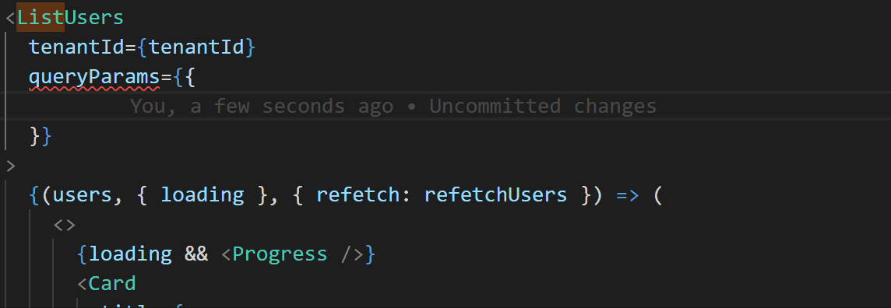
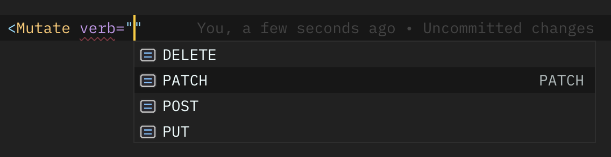
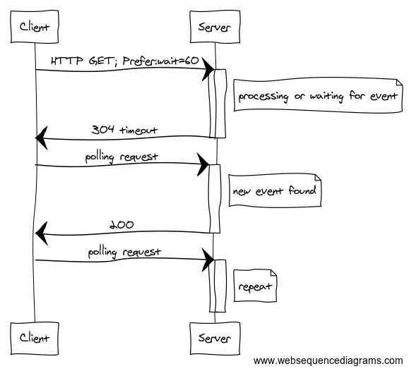

# RESTful React

Building React apps that interact with a backend API presents a set of questions, challenges and potential gotchas. This project aims to remove such pitfalls, and provide a pleasant developer experience when crafting such applications. It can be considered a thin wrapper around the [fetch API](https://developer.mozilla.org/en/docs/Web/API/Fetch_API) in the form of a React component.

As an abstraction, this tool allows for greater consistency and maintainability of dynamic codebases.

<!-- START doctoc generated TOC please keep comment here to allow auto update -->
<!-- DON'T EDIT THIS SECTION, INSTEAD RE-RUN doctoc TO UPDATE -->

- [Overview](#overview)
- [Getting Started](#getting-started)
- [Features](#features)
  - [Global Configuration](#global-configuration)
    - [`RestfulProvider` API](#restfulprovider-api)
  - [Composability](#composability)
    - [Full `Get` Component API](#full-get-component-api)
  - [Loading and Error States](#loading-and-error-states)
  - [Lazy Fetching](#lazy-fetching)
  - [Response Resolution](#response-resolution)
  - [Debouncing Requests](#debouncing-requests)
  - [TypeScript Integration](#typescript-integration)
  - [Query Parameters](#query-parameters)
  - [Mutations with `Mutate`](#mutations-with-mutate)
    - [Full `Mutate` Component API](#full-mutate-component-api)
  - [Polling with `Poll`](#polling-with-poll)
    - [Long Polling](#long-polling)
    - [Full `Poll` Component API](#full-poll-component-api)
  - [Code Generation](#code-generation)
    - [Usage](#usage)
    - [Import from GitHub](#import-from-github)
    - [Transforming an Original Spec](#transforming-an-original-spec)
  - [Caching](#caching)
- [Contributing](#contributing)
  - [Code](#code)
  - [Dogfooding](#dogfooding)
- [Next Steps](#next-steps)

<!-- END doctoc generated TOC please keep comment here to allow auto update -->

## Overview

At its core, RESTful React exposes a component, called `Get`. This component retrieves data, either on mount or later, and then handles error states, caching, loading states, and other cases for you. As such, you simply get a component that _gets stuff_ and then does stuff with it. Here's a quick overview what it looks like.

[](https://codesandbox.io/s/30n66z45mq)

```jsx
import React from "react";
import Get from "restful-react";

const MyComponent = () => (
  <Get path="https://dog.ceo/api/breeds/image/random">
    {randomDogImage => }
  </Get>
);

export default MyComponent;
```

## Getting Started

To install and use this library, simply `yarn add restful-react`, or `npm i restful-react --save` and you should be good to go. Don't forget to `import Get from "restful-react"` or similar wherever you need it!

## Features

Restful React ships with the following features that we think might be useful.

### Global Configuration

API endpoints usually sit alongside a base, global URL. As a convenience, the `RestfulProvider` allows top-level configuration of your requests, that are then passed down the React tree to `Get` components.

Consider,

[](https://codesandbox.io/s/30n66z45mq)

```jsx
import React from "react";
import { RestfulProvider } from "restful-react";

import App from "./App.jsx";

const MyRestfulApp = () => (
  <RestfulProvider base="https://dog.ceo/api">
    <App />
  </RestfulProvider>
);

export default MyRestfulApp;
```

Meanwhile, in `./App.jsx`,

```jsx
import React from "react";
import Get from "restful-react";

const MyComponent = () => (
  /* Make a request to https://dog.ceo/api/breeds/image/random" */
  <Get path="/breeds/image/random">
    {randomDogImage => }
  </Get>
);

export default MyComponent;
```

Naturally, the request will be sent to the full path `https://dog.ceo/api/breeds/image/random`. The full API of the `RestfulProvider` is outlined below. Each configuration option is composable and _can be_ overriden by `Get` components further down the tree.

#### `RestfulProvider` API

Here's a full overview of the API available through the `RestfulProvider`, along with its defaults.

```tsx
// Interface
interface RestfulProviderProps<T> {
  /** The backend URL where the RESTful resources live. */
  base: string;
  /**
   * A function to resolve data return from the backend, most typically
   * used when the backend response needs to be adapted in some way.
   */
  resolve?: ResolveFunction<T>;
  /**
   * Options passed to the fetch request.
   * This can be a function if you want dynamically computed options each time.
   */
  requestOptions?: (() => Partial<RequestInit>) | Partial<RequestInit>;
}

// Usage
<RestfulProvider
  base="String!"
  resolve={data => data}
  requestOptions={authToken => ({ headers: { Authorization: authToken } })}
/>;
```

Here's some docs about the [RequestInit](https://developer.mozilla.org/en-US/docs/Web/API/Request/Request) type of request options.

### Composability

`Get` components can be composed together and request URLs are an accumulation of their collective path props. Consider,

[](https://codesandbox.io/s/30n66z45mq)

```jsx
// Assuming we're using a RestfulProvider with base="https://my.web/api somewhere,
import React from "react";
import Get from "restful-react";

export default () => (
  {/* Send a request to "https://my.web/api/breeds */}
  <Get path="/breeds">
    {data => {
      return (
        <div>
          <h1>Random Image</h1>
          {/*
            Composes path with parent: sends request to https://my.web/api/breeds/image/random.
            This happens because there is no preceding / to the path.
          */}
          <Get path="image/random">
            {image => }
          </Get>

          <h1>All Breeds</h1>

          {/*
            Composes path with parent: sends request to https://my.web/api/list
            The preceding slash (/) ALWAYS queries the ROOT of the RestfulProvider's base.
          */}
          <Get path="/list">
            {list => (
              <ul>{list && list.message.map(dogName => <li>{dogName}</li>)}</ul>
            )}
          </Get>
        </div>
      );
    }}
  </Get>
);
```

From the above example, _not only_ does the path compose based on the nesting of each `Get`, but each `Get` _can_ override its parent with other props as well: including having _specific_ `requestOptions` if there was a valid use case.

To opt-out of this behavior `Get` components can use an alternative URL as their `base` prop.

#### [Full `Get` Component API](src/Get.tsx#L50-L87)

### Loading and Error States

`Get` components pass down loading and error states to their children, to allow for state handling. Consider,

[](https://codesandbox.io/s/30n66z45mq)

```jsx
const MyAnimalsList = props => (
  <Get path={`/${props.animal}`}>
    {(animals, { loading, error }) =>
      loading ? (
        <Spinner />
      ) : (
        <div>
          You should only see this after things are loaded.
          {error ? (
            "OH NO!"
          ) : (
            <>
              <h1>
                Here are all my {props.animal}
                s!
              </h1>
              <ul>
                {animals.map(animal => (
                  <li>{animal}</li>
                ))}
              </ul>
            </>
          )}
        </div>
      )
    }
  </Get>
);
```

Within [Operational UI](https://github.com/contiamo/operational-ui), all of our [`<Progress />`](https://operational-ui.netlify.com/#!/Progress) components support an `error` prop. For _even_ better request state handling, we can write:

```jsx
const MyAnimalsList = props => (
  <Get path={`/${props.animal}`}>
    {(animals, { loading, error }) =>
      loading ? (
        <Progress error={error} />
      ) : (
        <div>
          You should only see this after things are loaded.
          <h1>
            Here are all my {props.animal}
            s!
          </h1>
          <ul>
            {animals.map(animal => (
              <li>{animal}</li>
            ))}
          </ul>
        </div>
      )
    }
  </Get>
);
```

### Lazy Fetching

It is possible to render a `Get` component and defer the fetch to a later stage. This is done with the `lazy` boolean prop. This is great for displaying UI immediately, and then allowing parts of it to be fetched as a response to an event: like the click of a button, for instance. Consider,

[](https://codesandbox.io/s/30n66z45mq)

```jsx
<Get path="/unicorns" lazy>
  {(unicorns, states, { get }) => (
    <div>
      <h1>Are you ready?</h1>
      <p>Are you ready to unleash all the magic? If yes, click this button!</p>
      <button onClick={get}>GET UNICORNS!!!!!!</button>

      {unicorns && (
        <ul>
          {unicorns.map((unicorn, index) => (
            <li key={index}>{unicorn}</li>
          ))}
        </ul>
      )}
    </div>
  )}
</Get>
```

The above example will display your UI, and then load unicorns on demand.

### Response Resolution

Sometimes, your backend responses arrive in a shape that you might want to adapt, validate, or reshape. Other times, maybe your data consistently arrives in a `{ data: {} }` shape, with `data` containing the stuff you want.

At the `RestfulProvider` level, _or_ on the `Get` level, a `resolve` prop will take the data and _do stuff_ to it, providing the final resolved data to the children. Consider,

[](https://codesandbox.io/s/30n66z45mq)

```jsx
const myNestedData = props => (
  <Get
    path="/this-should-be-simpler"
    resolve={response => response.data.what.omg.how.map(singleThing => singleThing.name)}
  >
    {data => (
      <div>
        <h1>Here's all the things I want</h1>
        <ul>
          {data.map(thing => (
            <li>{thing}</li>
          ))}
        </ul>
      </div>
    )}
  </Get>
);
```

### Debouncing Requests

Some requests fire in response to a rapid succession of user events: things like autocomplete or resizing a window. For this reason, users sometimes need to wait until all the keystrokes are typed (until everything's _done_), before sending a request.

Restful React exposes a `debounce` prop on `Get` that does exactly this.

Here's an example:

```jsx
const SearchThis = props => (
  <Get path={`/search?q=${props.query}`} debounce>
    {data => (
      <div>
        <h1>Here's all the things I search</h1>
        <ul>
          {data.map(thing => (
            <li>{thing}</li>
          ))}
        </ul>
      </div>
    )}
  </Get>
);
```

Debounce also accepts a number, which tells `Get` how long to wait until doing the request.

```diff
const SearchThis = props => (
-  <Get path={`/search?q=${props.query}`} debounce>
+  <Get path={`/search?q=${props.query}`} debounce={200 /*ms*/}>
    {data => (
      <div>
        <h1>Here's all the things I search</h1>
        <ul>{data.map(thing => <li>{thing}</li>)}</ul>
      </div>
    )}
  </Get>
);
```

It uses [lodash's debounce](https://lodash.com/docs/4.17.10#debounce) function under the hood, so you get all the benefits of it out of the box like so!

```diff
const SearchThis = props => (
  <Get
    path={`/search?q=${props.query}`}
-   debounce={200}
+   debounce={{ wait: 200, options: { leading: true, maxWait: 300, trailing: false } }}
  >
    {data => (
      <div>
        <h1>Here's all the things I search</h1>
        <ul>{data.map(thing => <li>{thing}</li>)}</ul>
      </div>
    )}
  </Get>
);
```

### TypeScript Integration

One of the most poweful features of RESTful React, each component exported is strongly typed, empowering developers through self-documenting APIs. As for _returned_ data, simply tell your data prop _what_ you expect, and it'll be available to you throughout your usage of `children`.


### Query Parameters

All components in this library support query params (`https://my.site/?query=param`) via a `queryParams` prop. Each `Get`, `Mutate` and `Poll` component is _generic_, having a type signature of `Get<TData, TError, TQueryParams>`. If described, the `queryParams` prop is _fully_ type-safe in usage and provides autocomplete functionality.



Please note that the above example was built using our [OpenAPI generator](#code-generation) in order to infer the type of component from the specification and automatically generate the entire type-safe component in a _very_ quick and easy way.

### Mutations with `Mutate`

Restful React exposes an additional component called `Mutate`. These components allow sending requests with other HTTP verbs in order to mutate backend resources.

[](https://codesandbox.io/s/30n66z45mq)

```jsx
const Movies = ({ dispatch }) => (
  <ul>
    <Get path="/movies">
      {(movies, states, actions) =>
        movies.map(movie => (
          <li>
            {movie.name}
            <Mutate verb="DELETE">
              {(deleteMovie, { loading: isDeleting }) => (
                <button onClick={() => deleteMovie(movie.id).then(() => dispatch("DELETED"))} loading={isDeleting}>
                  Delete!
                </button>
              )}
            </Mutate>
          </li>
        ))
      }
    </Get>
  </ul>
);
```

`Mutate` is strongly typed, and provides intelligent autocompletion out of the box, complete with available verbs and other self-documentation.



Each mutation returns a promise, that can then be used to update local component state, or dispatch an action, or do something else depending on your use case.

#### [Full `Mutate` Component API](src/Mutate.tsx#L31-L47)

### Polling with `Poll`

RESTful React also exports a `Poll` component that will poll a backend endpoint over a predetermined interval until a stop condition is met. Consider,

```jsx
import { Poll } from "restful-react"

<Poll path="/deployLogs" resolve={data => data && data.data}>
  {(deployLogs: DeployLog[], { loading }) =>
    loading ? (
      <PageSpinner />
    ) : (
      <DataTable
        columns={["createdAt", "deployId", "status", "sha", "message"]}
        orderBy="createdAt"
        data={deployLogs}
        formatters={{
          createdAt: (d: DeployLog["createdAt"]) => title(formatRelative(d, Date.now())),
          sha: (i: DeployLog["sha"]) => i && i.slice(0, 7),
        }}
      />
    )
  }
</Poll>
```

Note the API similarities that we have already uncovered. In essence, `Poll`, `Get` and `Mutate` have near-identical APIs, allowing developers to quickly swap out `<Get />` for `<Poll />` calls and have the transition happen seamlessly. This is powerful in the world of an ever-changing startup that may have volatile requirements.

In addition to the `Get` component API, `Poll` also supports:

- an `interval` prop that will poll at a specified interval (defaults to polling 1 second), and
- an `until` prop that accepts a condition expressed as a function that returns a boolean value. When this condition is met, polling will stop.
  - the signature of this function is `(data: T, response: Response) => boolean`. As a developer, you have access to the returned data, along with the response object in case you'd like to stop polling if `response.ok === false`, for example.

Below is a more convoluted example that employs nearly the full power of the `Poll` component.

```jsx
<Poll path="/status" until={(_, response) => response && response.ok} interval={0} lazy>
  {(_, { loading, error, finished, polling }, { start }) => {
    return loading ? (
      <Progress error={error} />
    ) : (
      <Button
        loading={editorLoading || polling}
        condensed
        icon="ExternalLink"
        color="ghost"
        onClick={() => {
          if (finished) {
            return window.open(editor.url);
          }
          requestEditor();
          start();
        }}
      >
        {finished ? "Launch Editor" : "Request Editor"}
      </Button>
    );
  }}
</Poll>
```

Note from the previous example, `Poll` also exposes more states: `finished`, and `polling` that allow better flow control, as well as lazy-start polls that can also be programatically stopped at a later stage.

#### Long Polling

At Contiamo, we have a [powerful Long Polling specification](docs/contiamo-long-poll.md) in place that allows us to build real-time apps over HTTPS, as opposed to WebSockets. At a glance the specification can be distilled into:

- Web UI sends a request with a `Prefer` header that contains:
  - a time, in seconds, to keep requests open (`60s`), and
  - a **polling index** that is a server-sent hash `ahpiegh`.
  - all together, the client sends a request with a header `Prefer: wait=60s;index=939192`.
- The backend server responds, either with:
  - an empty response with status `304 Not Modified`
  - a successful response with data and a new **polling index**.

The polling index allow the client and the server to stay in sync: the client says "the last stuff I got was at this index". The server says "oh, let me get you up to speed and send you a new index".

Visually, this is represented as below.

.

To get this functionality in Restful React, it is as simple as specifying a `wait` prop on your `Poll` component, provided your server implements the specification as well.

#### [Full `Poll` Component API](src/Poll.tsx#L53-L101)

### Code Generation

Restful React is able to generate _type-safe_ React components from any valid OpenAPI v3 or Swagger v2 specification, either in `yaml` or `json` formats.

#### Usage

Type-safe React data fetchers can be generated from an OpenAPI specification using the following command:

- `restful-react import --file MY_OPENAPI_SPEC.yaml --output my-awesome-generated-types.d.tsx`

This command can be invoked by _either_:

- Installing `restful-react` globally and running it in the terminal: `npm i -g restful-react`, or
- Adding a `script` to your `package.json` like so:

```diff
      "scripts": {
        "start": "webpack-dev-server",
        "build": "webpack -p",
+       "generate-fetcher": "restful-react import --file MY_SWAGGER_DOCS.json --output FETCHERS.tsx"
      }
```

Your components can then be generated by running `npm run generate-fetcher`. Optionally, we recommend linting/prettifying the output for readability like so:

```diff
      "scripts": {
        "start": "webpack-dev-server",
        "build": "webpack -p",
        "generate-fetcher": "restful-react import --file MY_SWAGGER_DOCS.json --output FETCHERS.tsx",
+       "postgenerate-fetcher": "prettier FETCHERS.d.tsx --write"
      }
```

You have some command examples in `package.json` (commands than begin with `example:`), just replace `node lib/bin/restful-react.js` with `restful-react`. These examples are used to try the CLI locally 😉 (please also note that a `yarn build` is necessary before running any example)

#### Validation of the specification

To enforce the best quality as possible of specification, we have integrate the amazing open-api linter from ibm ([OpenAPI Validator](https://github.com/IBM/openapi-validator)). We strongly encourage you to setup your custom rules with a `.validaterc` file, you can find all useful information about this configuration [here](https://github.com/IBM/openapi-validator/#configuration).

To activate this, just add `--validation` flag.

#### Import from GitHub

Adding the `--github` flag to `restful-react import` instead of a `--file` allows us to **create React components from an OpenAPI spec _remotely hosted on GitHub._** <sup>_(how is this real life_ 🔥 _)_</sup>

To generate components from remote specifications, you'll need to follow the following steps:

1.  Visit [your GitHub settings](https://github.com/settings/tokens).
1.  Click **Generate New Token** and choose the following:

        Token Description: (enter anything, usually your computer name)
        Scopes:
            [X] repo
                [X] repo:status
                [X] repo_deployment
                [X] public_repo
                [X] repo:invite

1.  Click **Generate token**.
1.  Copy the generated string.
1.  Open Terminal and run `restful-react import --github username:repo:branch:path/to/openapi.yaml --output MY_FETCHERS.tsx`.
1.  You will be prompted for a token.
1.  Paste your token.
1.  You will be asked if you'd like to save it for later. This is _entirely_ up to you and completely safe: it is saved in your `node_modules` folder and _not_ committed to version control or sent to us or anything: the source code of this whole thing is public so you're safe.

    **Caveat:** _Since_ your token is stored in `node_modules`, your token will be removed on each `npm install` of `restful-react`.

1.  You're done! 🎉

#### Transforming an Original Spec

In some cases, you might need to augment an existing OpenAPI specification on the fly, for code-generation purposes. Our CLI makes this quite easy:

```bash
  restful-react import --file myspec.yaml --output mybettercomponents.tsx --transformer path/to/my-transformer.js
```

The function specified in `--transformer` is pure: it imports your `--file`, transforms it, and passes the augmented OpenAPI specification to Restful React's generator. Here's how it can be used:

```ts
// /path/to/my-transformer.js

/**
 * Transformer function for restful-react.
 *
 * @param {OpenAPIObject} schema
 * @return {OpenAPIObject}
 */
module.exports = inputSchema => ({
  ...inputSchema,
  // Place your augmentations here
  paths: Object.entries(schema.paths).reduce(
    (mem, [path, pathItem]) => ({
      ...mem,
      [path]: Object.entries(pathItem).reduce(
        (pathItemMem, [verb, operation]) => ({
          ...pathItemMem,
          [verb]: {
            ...fixOperationId(path, verb, operation),
          },
        }),
        {},
      ),
    }),
    {},
  ),
});
```

#### Advanced configuration

You have multiple backends? Need more control on the generated code? We have the solution!

-> The `restful-react.config.js` (Note, this will make all other flags not relevant).

To activate this "advanced mode", just replace all flags with `--config restful-react.config.js` (or any filename that you want)

Format of the config:

```ts
interface RestfulReactConfig {
  [backend: string]: {
    // classic configuration
    output: string;
    file?: string;
    github?: string;
    transformer?: string;
    validation?: boolean;

    // advanced configuration
    customImport?: string;
    customProperties?: {
      base?: string;
    };
  };
}
```

Example:

```js
// restful-react.config.js

module.exports = {
  myFirstBackend: {
    output: "src/queries/myFirstBackend.tsx",
    file: "specs/my-first-backend.yaml",
    customProperties: {
      base: `"http://my-first-backend.com"`,
    },
  },
  configurableBackend: {
    output: "src/queries/configurableBackend.tsx",
    github: "contiamo:restful-react:master:docs/swagger.json",
    customImport: `import { getConfig } from "../components/Config.tsx";`,
    customProperties: {
      base: `{getConfig("backendBasePath")}`,
    },
  },
};
```

```json
// package.json
{
  "scripts": {
    "gen": "restful-react import --config restful-react.config.js"
  }
}
```

### Caching

This doesn't exist yet.
Feel free to contribute a solution here.

An LRU cache would be nice.

## Contributing

All contributions are welcome – especially:

- documentation,
- bug reports and issues,
- code contributions.

### Code

If you'd like to actively develop or maintain this project, clone the repo and then `yarn watch` to get into dev mode. There are existing tests against which you can test the library. Typically, this looks like

- `git clone git@github.com:contiamo/restful-react.git`
- `cd restful-react`
- `yarn install`
- `yarn test --watch`

From there, you should be able to start developing without problems.

### Dogfooding

This project works great when [dogfooded](https://www.google.com/search?q=dogfooding): I'd suggest creating a separate project somewhere (or using an existing one), and using your fork in your project. To do so, after cloning and `npm i`,

- `npm link` inside of the root folder of this project,
- go to your consumer project,
- `npm link restful-react` in there, and `npm` will link the packages.

You can now `import Get from "restful-react"` and do all the things you'd like to do, including test and develop new features for the project to meet your use case.

## Next Steps

We're actively developing this at Contiamo to meet our use cases as they arise. If you have a use case that you'd like to implement, do it! Open an issue, submit a Pull Request, have fun! We're friendly.
